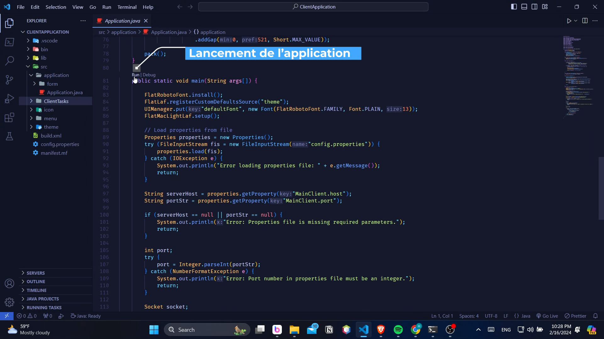
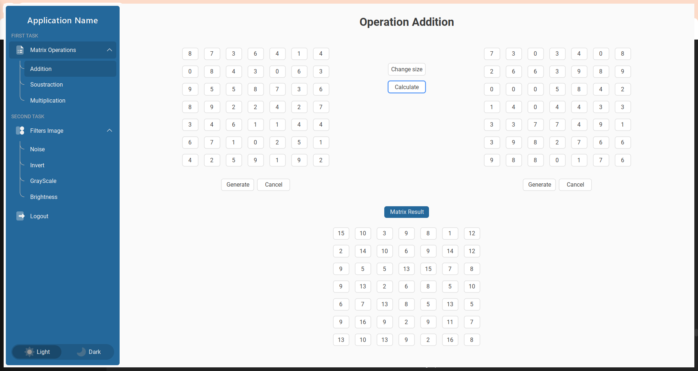
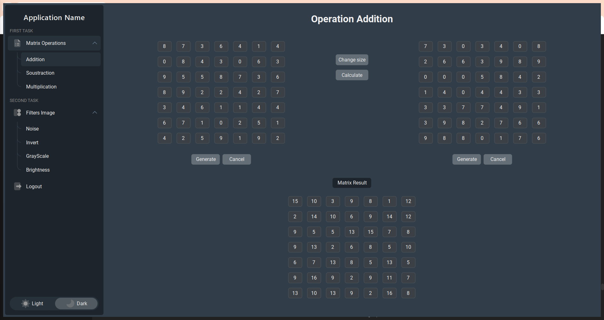
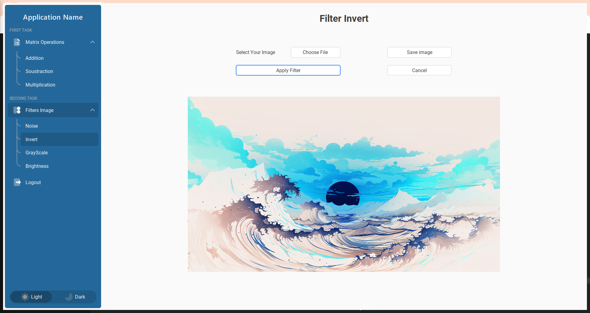
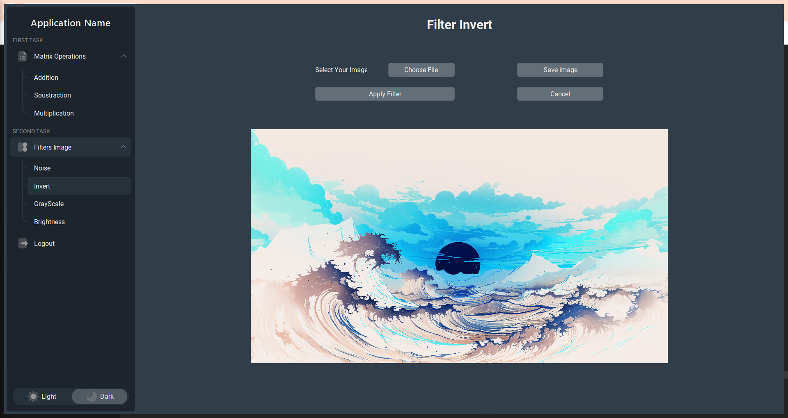

# Système de Traitement Distribué - Matrices et Filtrage d'Images

Le projet propose un système de traitement distribué permettant le traitement efficace des opérations sur les matrices et le filtrage d'images. Les utilisateurs soumettent leurs demandes au serveur central, qui répartit les tâches sur des esclaves disponibles. L'architecture distribuée assure une exécution parallèle des tâches, tandis qu'une interface utilisateur intuitive simplifie la soumission et le suivi des tâches.
Le projet vise à fournir une solution polyvalente pour le traitement distribué de données, adaptable à divers domaines d'application.

## Fonctionnalités

- Envoi de demandes de traitement de matrices ou de filtrage d'images au serveur central.
- Traitement distribué des tâches sur plusieurs esclaves via des sockets ou RMI.
- Possibilité de spécifier des paramètres supplémentaires pour les opérations sur les matrices et les filtres d'images.
- Interface graphique pour le client facilitant la sélection des tâches, réalisée en utilisant Swing avec FlatLaf.

## Utilisation

- **Compilation du projet :** Compilez le projet en utilisant la commande de compilation appropriée.
- **Démarrage du serveur :** Lancez le serveur central en exécutant `java Server`.
- **Lancement des esclaves :** Démarrez un ou plusieurs esclaves individuellement en utilisant `java Slave`.
- **Lancement l'interface du client :** Pour exécuter l'application, vous pouvez la lancer depuis un éditeur.

## Exemple d'utilisation

- **Démarrage du serveur :**

```bash
  cd /ProjetJava/Server/bin
  java Server
```

- **Lancement des esclaves :**

```bash
  cd /ProjetJava/Slave/bin
  java Slave

```

- **Lancement l'interface du client :**



## Captures d'Écran d'interface

 

 

## Réalisé par

- CHOKRI HOSSAM
- OTHMANE ZOUHRI
- HAMZA ZOUHRI
