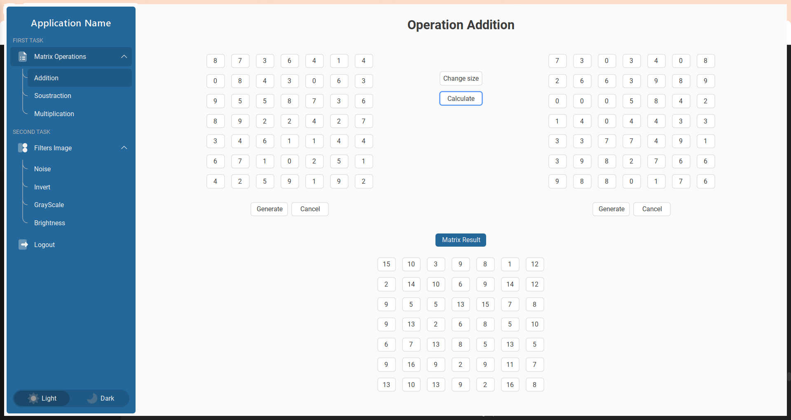
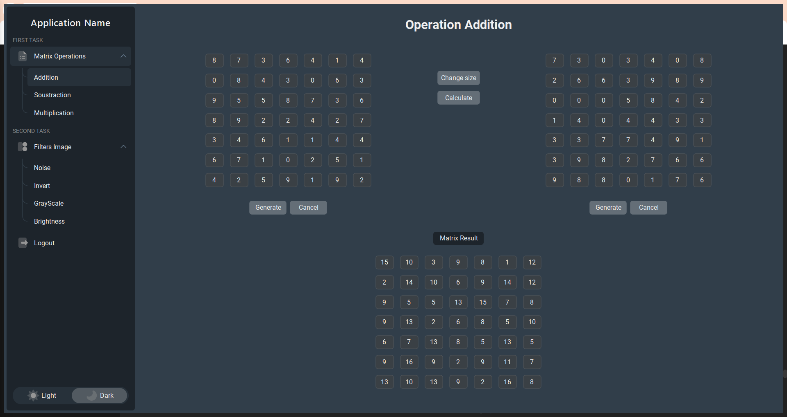
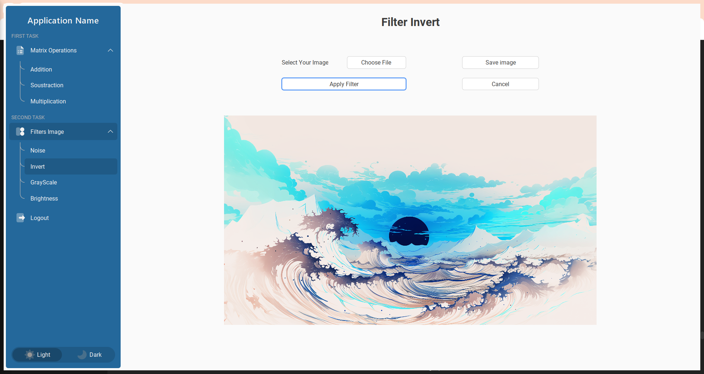
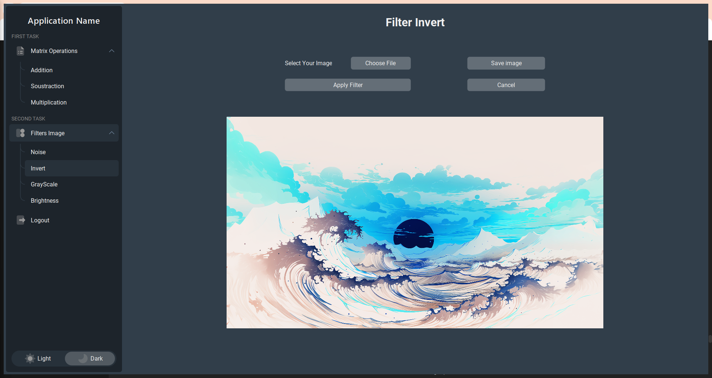

# Système de Traitement Distribué - Matrices et Filtrage d'Images

Le projet propose un système de traitement distribué qui gère efficacement les opérations sur les matrices et le filtrage d'images. Les utilisateurs soumettent leurs requêtes à un serveur central, qui distribue les tâches entre les nœuds de travail disponibles. L'architecture distribuée garantit l'exécution parallèle des tâches, tandis qu'une interface utilisateur intuitive simplifie la soumission et le suivi des tâches.

Le projet vise à fournir une solution polyvalente pour le traitement distribué de données, adaptable à divers domaines d'application.

## Fonctionnalités

- Soumettre des requêtes pour le traitement de matrices ou le filtrage d'images au serveur central.
- Traitement distribué des tâches entre plusieurs nœuds de travail via des sockets ou RMI.
- Possibilité de spécifier des paramètres supplémentaires pour les opérations sur les matrices et les filtres d'image.
- Interface graphique conviviale pour le client, créée avec Swing et FlatLaf.

## Captures d'Écran de l'Interface

 

 
